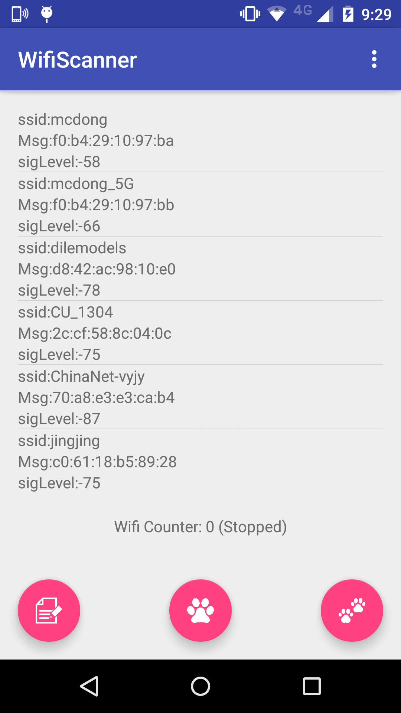

# wifiScanner

Release 1.0

The application is used to scan wifi around. The functionalities contain:

	- Save records in your mobile (yourSdcard/wifiscanner/yymmdd_name)
	- Check the wifi around
	- Record wifi around

### Preview

